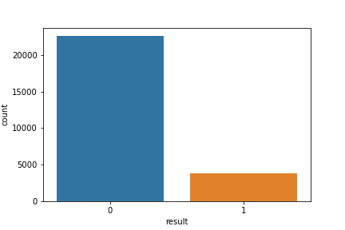
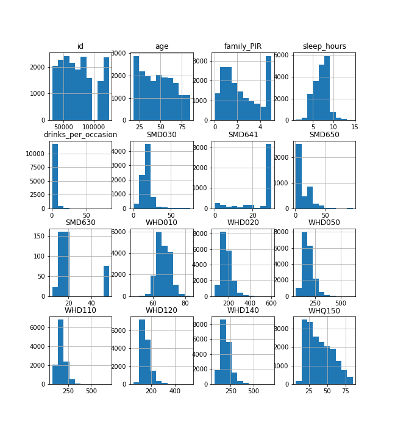
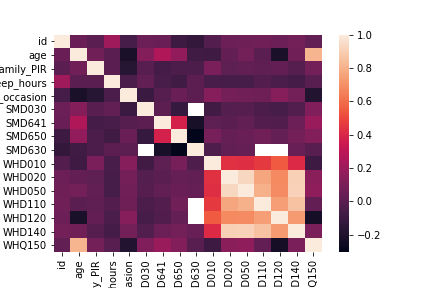

# Executive Summary
The National Health and Nutrition Examination Survey database between 2005 and March 2020 has been used in this project. The HNANES data set has 26,473 respondents, and 29 variables, including id, depression result, and 27 predictors about demographics, sleep disorders, alcohol use, smoking (cigarette use) and weight history information, including 15 numerical and 12 categorical variables. For our target variable - depression, we used a scoring system [@score] to have a binary result, if the score is lower than 10, then the individual is healthy. Our primary goal in this project was to train a machine learning classification model to identify patients who suffer from depression using demographics and healthcare data from the NHANES database. 

Several concerns need to be considered in this project. For example, whether we got permission and notified every respondent before using their information is essential, especially under legislation in different states. And whether we can take to maintain integrity and confidentiality is making sure that only authorized users have access to the data. 

30% of the data are used as test data and the rest are used for training models. The predictors have missing urate less than 50%, so we performed median imputation on all the numerical variables and the most frequent category imputation on categorical variables. Since all variables have a very different scale, we Standardized continuous variables. We also converted all categorical variables using a one-hot encoder, so they can provide helpful information and be used in the machine learning algorithms.

K-nearest neighbours and Random forests are the main models we will be building and training for our project, and we used 5-fold repeated cross-validation to compare the performances. Since all of the models have really small variances in accuracy, with less than 0.003, we will only consider the accuracy score. We can see in Table 1, of all of the classification algorithms investigated, our best model is a random forest with tuned parameters model with an accuracy of 85.6%, closely followed by the ensemble model, and feature selection did not improve prediction accuracy so they are not included in the table. 

| Model                      | Mean Accuracy | Standard Deviation |
|:---------------------------|:--------------|:-------------------|
| K-nearest neighbours       | 0.84471       | 0.0029             |
| Random forest              | 0.85468       | 0.0019             |
| Tuned K-nearest neighbours | 0.85275       | -                  |
| Tuned Random forest        | 0.85525       | -                  |
| Ensemble                   | 0.85387       | 0.0014             |

Table: Results for each model

# Background
A study found that depression increased from 9% in 2017–2018 to over 14% in April 2020 among US adults during the COVID-19 pandemic. A study found that depression increased from 9% in 2017–2018 to over 14% in April 2020 among US adults during the COVID-19 pandemic. Among different age groups, the mental health of young adults is most affected by the pandemic. This increased rate was not normal compared to other years, and there was not enough attention paid to data examining tools either. [@depressionStats] Although there is an increasing number of adults with depression, the average treatment cost per individual decreased, which means more and more people have not been able to receive any treatment.[@cost] People who are depressed are also far more likely to be diagnosed with other diseases, such as heart disease, diabetes, and high blood pressure.

There are blood tests, brain scans and other medical examining methods for a depression diagnosis. In the end, the most affected way is to let the patients describe their symptoms. To achieve this, patients can answer a questionnaire like determining the frequency of depression symptoms over the past two weeks. This method may lead to subjective bias and imperfections in the diagnostic capabilities. [@diagnose] However, the cause of depression could be from many other things, such as sleep disorders, drug use, alcohol use and weight loss. For example, if a person has been working in a stressful environment with low income and not enough sleep, that person may have a higher chance than other people to have depression.

Healthcare data from the National Health and Nutrition Examination Survey database includes a wide range of concepts, like health records, genetic information and even demographic data. Furthermore, machine learning tools tend to perform better than humans at processing these big data sets and making use of it.[@bias] 

Our primary goal in this project was to train a machine learning classification model to identify patients who suffer from depression using demographics and healthcare data from the NHANES database.

# Data Description
The NHANES 2005 - March 2020 year range was selected as the data set for this project. We did not go before 2005 because the survey questions were different compared to later years. Demographics, sleep disorders, alcohol use, smoking (cigarette use) and weight history information are used as predictors since they are found to be primary factors for the cause of depression. We manually selected the variables with less than 50% missing rate from these data sets. For our target variable - depression, we used the Mental Health - Depression Screener data sets and PHQ-9 scoring system [@score] to identify whether a person has depression. The final scores of 0–4, 5–9, 10–14, 15–19, and 20–27 are the ranges for none, mild, moderate, moderately severe and severe depression, respectively. In our project, we wanted to focus on building a binary classification model, so if the respondent has a total score that is greater than or equal to 10, then the individual is identified as having depression. 

As a result, we have 29 variables in our data set, including id, depression result, and 27 predictors, including 15 numerical and 12 categorical variables. Table 2 and 3 show the descriptions of data.

| Variable                | Description                                        |
|:------------------------|:---------------------------------------------------|
| id                      | Unique identifier for each respondent              |
| age                     | The age of the respondent                          |
| family_PIR               | Poverty income ratio (PIR) - a ratio of family income to poverty threshold|
| sleep_hours             | Total hours of sleep                               |
| drinks_per_occasion     | Average drinks per day                             |
| SMD030                  | Age started smoking cigarettes regularly           |
| SMD641                  | Number of days smoked cigarettes during the past 30 days|
| SMD650                  | Average number of cigarettes per day during past 30 days|
| SMD630                  | Age first smoked the whole cigarette               |
| WHD010                  | Height of the respondent (inches)                  |
| WHD020                  | Weight of the respondent (pounds)                  |
| WHD050                  | Weight of the respondent (pounds) 1 year ago       |
| WHD110                  | Weight of the respondent (pounds) 10 years ago     |
| WHD120                  | Weight of the respondent (pounds) at the age of 25 |
| WHD140                  | Respondent's heaviest weight (pounds)              |
| WHQ150                  | Age of the respondent when heaviest weight         |

Table: Description of the numerical data

| Variable                | Description                                        |
|:------------------------|:---------------------------------------------------|
| result                  | Whether the respondent has depression (1=Yes, 0=No)|
| gender                  | Gender of respondent                               |
| race                    | Race of respondent                                 |
| marital_status          | The marital status of the respondent               |
| education_level_adults  | Highest level of education of the respondent       |
| language                | Language of the respondent                         |
| trouble_sleeping_history| Whether had trouble sleeping                       |
| SMQ020                  | Whether had smoked at least 100 cigarettes in life |
| SMQ040                  | Frequency of smoking cigarettes                    |
| SMQ670                  | Whether tried to quit smoking                      |
| WHQ030                  | How respondent consider their weight               |
| WHQ040                  | Respondent likes to weigh more, less or the same   |
| WHQ070                  | Whether the respondent tried to lose weight in the past year|

Table: Description of the categorical data

We had 43,928 entries when we first combined all the data sets, but we need the respondent to answer every single question in the Mental Health - Depression Screener Survey to calculate the score. Therefore, we had to remove the respondent who did not complete the survey, which gave us 26,473 data at the end. (17,455 respondents were taken out)

The structure of the missing data in our data set varied from variable to variable, so we had to find the data description for each variable from the NHANES website and convert them to NA. For example, 7, 777 and 7777 could all be refused to answer the survey question; both "-1" and "." mean no answers.

Another problem we had was that the variables in the data set from each year may be different or have different names. We ended up choosing the variables that appeared every year and changing them to have the same names.

# Ethics, Privacy and Security
## Ethical Considerations
There are a number of ethical concerns that need to be considered when developing and deploying a machine learning algorithm that predicts if an individual is depressed. First, it is important to consider the potential impact of false positives and false negatives. If the algorithm incorrectly predicts that an individual is depressed, this could lead to them being unnecessarily treated or stigmatized. On the other hand, if the algorithm fails to predict that an individual is depressed, this could result in them not receiving the help they need.

## Privacy Concerns
### Access and use
Whether we got permission and notified every respondent before using their information is essential, especially under legislation in different states. Also, our model requires access to many respondents’ data, and we need to prevent the data from being used in different ways over time.

### Re-identification
Another concern with healthcare data is whether we can protect patients’ information. A lot of research shows that people can use different techniques to re-identify individuals in the data. However, on the other hand, too much de-identification may diminish the clinical utility of the data, but too little de-identification may lead to a breach of privacy. [@concerns]

## Security concerns
If the algorithm is made public via a data leak, then anyone could use it to find out which individuals are more likely to be depressed. This information could be used to target those individuals with ads or content that exploits their vulnerabilities. For example, an advertiser could show ads for antidepressant medications to someone who is predicted to be depressed.

### Steps to secure data
The steps we can take to maintain integrity and confidentiality is making sure that only authorized users have access to the data. To do that, we can:

- Make the GitHub repository private. That way only authorized people have access (group members)
- Password can protect our data- with a password that is only distributed to the users who are authorized access
- To protect the integrity of the data, we can make sure only to have information that is needed for this analysis, as well as not re-identifying the data (which is mentioned in privacy concerns)

# Exploratory Data Analysis
There are 26473 observations and 29 variables in our data set. Of those 29 features, 28 are explanatory variables, and the other 2 are our target variable and a unique id for each respondent. Due to the way the NHANES data was encoded, all variables are currently considered to be numeric, even though some of these variables are actually categorical. This will need to be changed before we start our modelling. We have 15 numerical and 12 categorical variables, and the actual numerical variables are; "age", "family_PIR", "sleep_hours", "drinks_per_occasion", "SMD030", "SMD641", "SMD650", "SMD630", "WHD010", "WHD020", "WHD050", "WHD110", "WHD120", "WHD140", "WHQ150".

All the variables apart from the result, age, gender, race and trouble_sleeping_history have missing values. Imputation of some form will be used to deal with this before we start building our model.

## Summary Table
### Categorical Summary
Figure 1 shows the total number of respondents who has depression (=1) or do not have depression (=0). We can see that there are way more respondents that do not suffer from depression. This means our data set is imbalanced, so we need to deal with the imbalanced classification problem while splitting the data set for model training.

### Numerical Summary
From Figure 2, we can see that all the numerical variables appear do not have a normal distribution, and most of them are skewed.

## Correlation
Figure 3 shows the correlation between all numerical variables, and Table 4 shows the variables pairs with a high correlation, higher than 0.8. 

From Figure 3 and Table 4, we can see that the weight of the respondent one year ago and the weight of the respondent (pounds) have the strongest positive correlation, which is 0.9305. As you can see, those variables all start with "WH, " meaning they are from the Weight History data set. This is expected as all of these variables are related to the individual's weight and height, which are known to have a linear relationship between them. This suggests that multi-collinearity may be present, meaning some of these variables may need to be removed before modelling, depending on the type of model being created.

| Variable A | Variable B | Correlation |
|:-----------|:-----------|:------------|
| WHD110     | WHD050     | 0.8061      |
| age        | WHQ150     | 0.8080      |
| WHD110     | WHD140     | 0.8622      |
| WHD020     | WHD140     | 0.9063      |
| WHD050     | WHD140     | 0.9122      |
| WHD050     | WHD020     | 0.9305      |

Table: High correlation pairs (>0.8)

# Detailed Analysis Results
Our goal is to build a binary machine learning classifier to predict whether an individual has depression. We build, train and evaluate our models using the K-nearest neighbours algorithm and Random forest algorithm from the Sklearn Python package. 5-fold repeated cross-validation was used to generate the mean accuracy, which is the performance matrix for selecting the best model. All analyses are run in Python 3.7.6.

## Data Preprocessing
Here are the steps I took to manipulate the data before building the model:
- Since variable 'id' does not have any meaning for the target variable, we decided to delete it.

- All variables are encoded as numerical variables from the original data set, so I first changed the categorical variables to type 'object'.

- Sklearn can not handle missing values in the data set, leading to errors. Furthermore, we do not want to lose those valuable data because it might cause bias in building the model. So we performed median imputation on all the numerical variables and the most frequent category imputation on categorical variables.

- As you can see from the previous section (Figure 2), all variables have a very different scale. Moreover, K-nearest neighbours, one of the algorithms we will use later for building models, uses the distance between new data and the observations from the training set to predict its label. Standardizing continuous variables will make all variables have equal contributions to the measurements.

- We also converted all categorical variables using a one-hot encoder, so they can provide helpful information and be used in the machine learning algorithms.

## Evaluate Several Machine Learning Models
K-nearest neighbours and Random forests are the main models we will be building and training for our project, as they are the most common classification methods. We used 5-fold repeated cross-validation to get the mean accuracy for comparing different models.  

We have nine models at the end of our model evaluation. For each algorithm, we have eight models, including a base model with the default parameters, a model with the tuned parameters, a model with variables selected using the SelectKBest feature selection method and another with the SelectFromModel method. Finally, we used two tuned models to build an ensemble model using the voting method.

### Defualt Models

| Model                | Mean Accuracy | Standard Deviation |
|:---------------------|:--------------|:-------------------|
| K-nearest neighbours | 0.84471       | 0.0029             |
| Random forest        | 0.85468       | 0.0019             |

Table: Mean Accuracy scores of default models

### Feature Selection

| Model                | Feature Selection Method | Mean Accuracy | Standard Deviation |
|:---------------------|:-------------------------|:--------------|:-------------------|
| K-nearest neighbours | SelectKBest              | 0.83615       | 0.0049             |
| Random forest        | SelectKBest              | 0.83611       | 0.0036             |
| K-nearest neighbours | SelectFromModel          | 0.84349       | 0.0031             |
| Random forest        | SelectFromModel          | 0.85466       | 0.0015             |

Table: Mean Accuracy scores of default models with the best features.

### Parameters tuning

| Model                      | Best Accuracy | 
|:---------------------------|:--------------|
| Tuned K-nearest neighbours | 0.85275       |
| Tuned Random forest        | 0.85525       |

Table: Best Accuracy scores of tuned models

### Ensemble Learning

| Model    | Mean Accuracy | Standard Deviation |
|:---------|:--------------|:-------------------|
| Ensemble | 0.85387       | 0.0014             |

Table: Mean Accuracy scores of the ensemble model

Table 5 shows that the Random forest with default parameters has higher accuracy than the K-nearest neighbours model. We have tried model selection, parameter tuning and ensemble learning to see whether we can improve the model performance. We can see from Table 6 that feature selection did not improve the model performance, so we are not considering those as the final model. In the following table (Table 7), we tried to tune the parameters for both models, and we can see that the accuracy for both models has increased. Overall, the random forest with the tuned parameters performs the best, with a mean accuracy of 0.85525. Finally, in Table 7, we can find out that the accuracy of the ensemble model is slightly worse than the random forest models.

Since all of the models have really small variances in accuracy, with less than 0.003, we will only consider the accuracy score. We are using the random forest with the tuned parameters as our final model based on the result because it has the best performance compared to other models.

## Making Predictions

| Model                      | Test Accuracy |
|:---------------------------|:--------------|
| K-nearest neighbours       | 0.84651       |
| Random forest              | 0.85608       |
| Tuned K-nearest neighbours | 0.85520       |
| Tuned Random forest        | 0.85646       |
| Ensemble                   | 0.85659       |

Table: Accuracy scores on the test set for each model

Table 9 shows the accuracy scores on the test set for all the models we have built for the project. We can see that the ensemble model has the highest accuracy, 0.85659, and the following model is the random forest with tuned parameters of 0.85646. The difference between each model is really small, around 0.0001. For this project, our final model is still the random forest with tuned parameters.

Although our project gives a pretty decent result, there are a few things we need to consider. First, the data may be biased. [@potentialbiases] Our data set only has people from America, and we did not take age, race, culture and sexual orientation into consideration, meaning we have imbalanced social groups. Second, there might be measurement biases [@measurement], this is about how the accuracy is being measured. We might want to know the false negative and false positive rates instead of just accuracy. And it might be more important to know how many people have depression but are predicted as healthy.

# Conclusions and Recommendations
In conclusion, of all of the classification algorithms investigated, our best model is a random forest with tuned parameters model with an accuracy of 85.6%, closely followed by the ensemble model, and feature selection did not improve prediction accuracy. The accuracy is pretty high and it could help advise whether a person has depression, but a false negative rate needs to take into consideration too. In this project, the number of algorithms and methods for improving accuracy is limited. We should investigate more models, for example, the Support Vector Machine and Decision Trees model, as they are also commonly used for solving supervised classification problems. We can also take action on handling outliers and balanced data in each social group in the future, to have a less biased result. 

# Reference List

